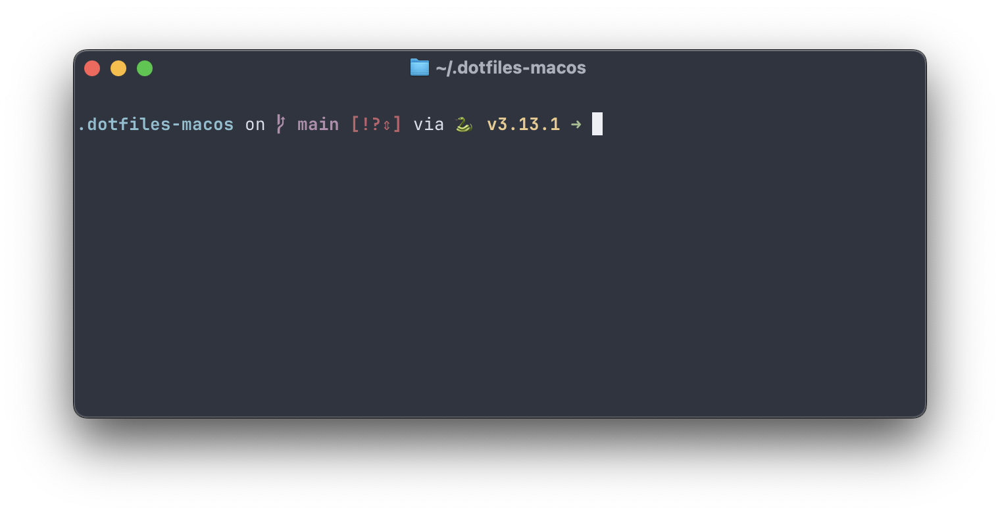

<p align="center">
  <a href="https://github.com/jonjohansen/.dotfiles-macos">
    
  </a>

  <p align="center">
    My customized dotfiles for macOS
    <br />
    <br />
    <strong>• Homebrew • Starship • Mac preferences • ghostty •</strong>
    <br />
  </p>
  <p align="center">
    
  </p>
</p>

## Overview


- [Requirements](#requirements)
- [Installation](#installation)
- [Customization](#customize)
- [Content](#content)

## Requirements

To be able to install the dotfiles, you are going to need `git` and various developer tools. These are shipped with the macos **command-line-tools.** To install these run:

```
xcode-select --install
```

You also need to have [Homebrew](https://brew.sh) installed. Follow instructions on their website to get started.

## Installation

The dotfiles are configured to be installed under `~/.dotfiles-macos/`by default and should be cloned into `$HOME`.
**See** [location](#Location) to change this.

1. Clone this repository with:

```
git clone https://github.com/jonjohansen/.dotfiles-macos.git ~/.dotfiles-macos
```

> [!IMPORTANT]  
> Beware that some of the settings (especially those for [macos](.macos)) may require `sudo` privileges.

2. Run the python installation script

```
python3 install.py
```

## Customize

Everything can be customized, and it is recommended to get an overlook of what the dotfiles install and adjust them to preferred settings.

### Location

If you want to install the dotfiles somewhere else some paths are dependent on the DOTFILES variable.

in **`.zshrc`**

```
export DOTFILES="$HOME/.dotfiles-macos/"
```

> [!NOTE]
> There also is a reference to `$DOTFILES` in `install.py` which will have to be updated.

## Content

### Placements of configurations and settings

| What                     | Type       | Where            |
| ------------------------ | ---------- | ---------------- |
| [macOS][_macos_settings] | settings   | `.macos`         |
| [git][_git]              | config     | `git/.gitconfig` |
|                          | ignorefile | `git/.gitignore` |
| [ghostty][_ghostty]      | config     | `ghostty/config` |
| [zsh][_zsh]              | config     | `.zshrc`         |
| [starship][_starship]    | config     | `starship.toml`  |

## Disclaimer

These are my personal settings. You _should_ read through every line. Not that you're going to,
but it is recommended to find your own preferences. 💅

[_macos_settings]: https://macos-defaults.com/
[_zsh]: https://www.zsh.org/
[_starship]: https://starship.rs/
[_ghostty]:https://ghostty.org/
[_git]: https://git-scm.com/
